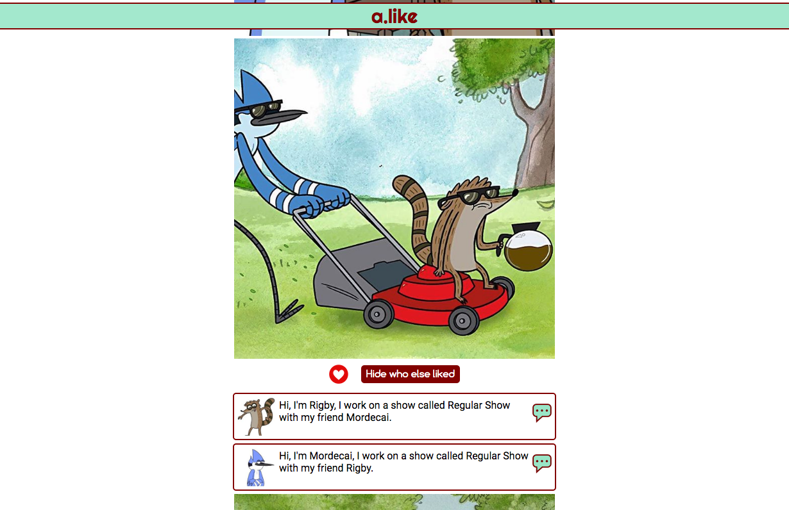
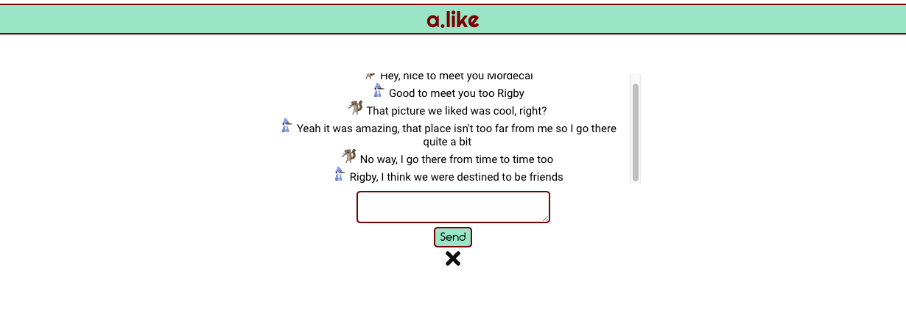

# a.like

**The app which uses social media interactions to connect people with similar interests.**

While the finished product will use multiple data points from various social networks to match user profiles, this initial iteration just looks at Instagram data and connects users who Like the same posts.

## User Journey

On opening the app for the first time you're asked to login with Instagram. This redirects to the Instagram authentication page which asks the user to give permission for the app to access three data scopes. Once permission is granted the user is then sent back to the app where they will see a feed of recent posts in their location.

From the feed page users can like and unlike media, see the profile picture and bio of other users who have liked the same media, and then initiate conversations with those users. As our aim is to encourage connections through behavioural similarities and shared interests rather than physical preferences, we never reveal a user's Instagram username or other personal information. Once connected, users can send messages to each other and chat in real time, and have access to all ongoing conversations from the top of their feed page.

## Technologies

* Node.js, JavaScript, HTML5, CSS3
* Instagram API
* Mongo/Mongoose
* Socket.io

## Feature Roadmap

* Message notifications
* Ability to delete conversations
* Show date and time on messages
* Notify when the other user is typing
* Ability to block users

## Future Improvements

Integration of other social network APIs (Facebook, Twitter, Snapchat, Swarm) to make profile connections even more accurate by using data which categorises interests and behaviours.

## Screenshots

